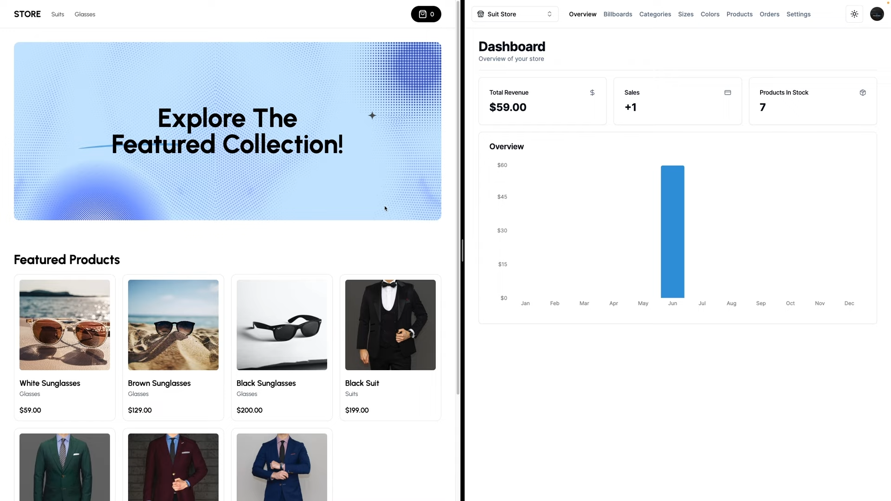
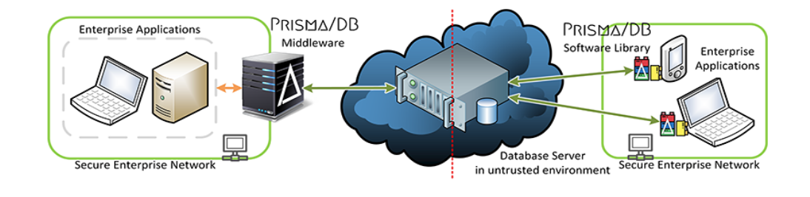

# 🛒 Full Stack E-Commerce Website + Dashboard & CMS

A complete E-Commerce platform with integrated Admin Dashboard & CMS, capable of supporting multiple business models like B2B, B2C, and C2C. The system allows seamless product management, order tracking, sales analytics, and centralized control for multiple stores — all from a single dashboard.

*Figure 1: Complete E-Commerce Ecosystem Overview*

## 📌 Project Features

### 🛍️ Customer-Side (E-Commerce Website)
✅ Browse & search products  
✅ Add to cart / checkout  
✅ Order placement & tracking  
✅ User login & authentication  
✅ Responsive UI  

### 🛠️ Admin Dashboard
✅ Manage Products / Categories  
✅ Manage Users & Orders  
✅ View Sales Reports & Analytics  
✅ Multi-business CMS control  
✅ Central panel to manage multiple stores  

### 🗂️ CMS (Content Management System)
✅ Centralized content management  
✅ Add / Edit / Remove products  
✅ Website content hosted via APIs  
✅ Real-time synchronization between CMS & front-end  

## 🧠 System Overview

| Layer | Description |
|-------|-------------|
| Frontend | E-Commerce UI + Customer Flow |
| Backend | API Services + DB connection |
| Admin Panel | CRUD access & analytics |
| CMS | Content control for products/pages |

*Figure 2: System Architecture Diagram*

## ✨ Key Highlights

📦 Full-stack multi-store E-Commerce solution  
🌐 CMS-driven dynamic website  
📊 Powerful sales analytics dashboard  
🧠 Designed for scalability & multi-business support  

## 🛠️ Tech Stack

### Frontend
- **React.js** / Next.js / Vue.js
- **Tailwind CSS** / Bootstrap
- **Redux** / Context API for state management
- **Chart.js** for analytics

### Backend
- **Node.js** / Express.js / Django
- **RESTful APIs** / GraphQL
- **JWT Authentication**
- **WebSocket** for real-time updates

### Database
- **MongoDB** / PostgreSQL
- **Redis** for caching
- **Elasticsearch** for search functionality

### Deployment
- **Docker** containerization
- **AWS** / Google Cloud / Azure
- **CI/CD** Pipeline

---
## 📊 API Endpoints

| Method | Endpoint | Description |
|--------|----------|-------------|
| GET | `/api/products` | Get all products |
| POST | `/api/products` | Create new product |
| PUT | `/api/products/:id` | Update product |
| DELETE | `/api/products/:id` | Delete product |
| POST | `/api/orders` | Create new order |
| GET | `/api/orders/:id` | Get order details |
| GET | `/api/categories` | Get all categories |
| POST | `/api/categories` | Create new category |
| GET | `/api/users` | Get all users |
| POST | `/api/auth/login` | User login |
| POST | `/api/auth/register` | User registration |
| GET | `/api/analytics/sales` | Get sales analytics |

## 🎯 Usage
### For Customers
- Browse products with search and filters
- Add items to cart
- Secure checkout process
- Track orders in real-time

### For Administrators
- Manage product inventory
- Process orders and shipments
- View sales analytics
- Manage multiple stores

### For Content Managers
- Update website content via CMS
- Manage product listings
- Control promotional banners
- Update pricing and inventory

(images/admin-dashboard.png)
Figure 3: Admin Dashboard Interface
